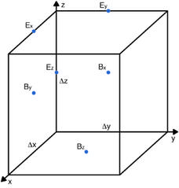

**NEEDS UPDATING AND PICTURES!**

User's Manual

Tristan-mp stands for TRIdimensional STANford - Massively Parallel code, and is the parallel version [1] of the code originally developed by O. Buneman, K. Nishikawa, and T. Neubert [2]. In its current form, the code is written in a modular format in Fortran 95, and uses the MPI (e.g. see Open MPI) and HDF5 libraries to support parallelism and standardized parallel output files. It is a fully relativistic Particle-In-Cell (PIC) code used for plasma physics computations; it self-consistently solves the full set of Maxwell's equations, along with the relativistic equations of motion for the charged particles. It follows the general PIC code architecture [3,4]: fields are discretized on a finite 3D or 2D mesh, the computational grid, and this field is then used to advance the velocity of the particles in time via the Lorentz force equation. The charges and currents derived from the particles' velocities and positions are then used as source terms to re-calculate the electromagnetic fields. The PIC simulation model is described below, along with the details of the numerical implementation of the physical equations.

Particle-In-Cell simulation model
The basic set of equations solved by Tristan-mp are Maxwell's equations:
 (1)

 (2)

along with the Lorentz force equation, and the relativistic dynamic equations for the electrons and ions

 (3)

 (4)

The particles' positions and velocities are used to calculate the current, which is used as a source term in Eq. (2). To self-consistently solve this set of equations, the electromagnetic fields and particles are first initialized in the simulation box, assuring initially divergence-free Electric and Magnetic fields, which is accomplished by initializing electrons and ions (or positrons) in the same spatial positions. The finite difference numerical implementation of the above equations, which usually varies from code to code, along with the numerical methods used, are presented in the next section.

**Numerical Implementation**

Tristan-mp uses time-centered and space-centered finite difference schemes to advance the equations in time, and to calculate spatial derivatives, so that the algorithm is second order accurate in space and time. A 3D Yee mesh [5] is used to store the Magnetic and Electric fields (see Fig. 1), and a tri-linear interpolation function (linear in each spatial dimension) is used to interpolate the Electric and Magnetic fields to the particles' positions. Furthermore, a three point digital binomial filter [3,4], with weights 0.25, 0.5, 0.25, is used along each spatial dimension on the source terms for the field equations, in order to suppress non-physical high-frequency field modes, which are due to the finite difference nature of the derivative calculations. Also, there is an option to select from the regular second order finite difference method [5], and a fourth order stencil as set forward in [6]; the purpose of the fourth order stencil is to reduce the effect of numerical Cerenkov instability, which might become a relevant factor for some relativistic runs [6].

 (4)

The electromagnetic fields are used to advance the particles' velocities using Eq. (3). There are two particle movers available in the code, both solving Eq. (3) and Eq. (4) explicitly: an implementation of the Boris algorithm [6], and an implementation of the Vay pusher [7]. These are two similar methods, with the Vay pusher having some advantages over the regular Boris algorithm in the relativistic regime.

The main PIC loop in Tristan-mp proceeds as follows, given the initial Electric field, Magnetic field, and Particles' positions and velocities:
1. Advance the Magnetic field by half a time step

2. Advance particles velocities and positions in time (using the Boris or Vay algorithms, Boris depicted here), and collect the current

3. Advance the Magnetic field by another half time step

4. Advance the electric field the full time step

Simulation and physical units

Tristan employs an unconventional system of electromagnetic units. Details about this system of units can be found in [this document](_pdf/tristan_units.pdf) (it has several typos, unfortunately). Note that, in practice, detailed understanding of this system of units is not necessary, as most every quantity can be expressed in dimensionless units. E.g. time normalized by plasma frequency, space by skin depths, speeds in terms of speed of light. By constructing dimensionless ratios, it is possible to avoid ever needing the conversion of any quantity into cgs.

Useful facts about code units: Electron plasma frequency in code units (inverse timesteps) is omega_pe = sqrt( q_e n / ((m/m_e) gamma)), where q is the charge of the particle, n density and gamma is the typical lorenz factor, m is particle's mass. Note that here 4 pi = 1 compared to cgs, and q_e/m_e = 1 by definition.
Cyclotron frequency: omega_c = B/(gamma (m/m_e) c) (in inverse time steps). Magnetization sigma = (omega_c)^2/ (omega_p)^2 (c/v)^2 = 1/M_A^2, where M_A is the alfvenic Mach #.

## Bibliography
1. Spitkovsky, A., Simulations of relativistic collisionless shocks: shock structure and particle acceleration, in AIP Conf. Ser. 801, ed. T. Bulik, B. Rudak, & G. Madejski (Melville, NY: AIP), 345, 2005
2. Buneman, O., Computer Space Plasma Physics (Terra Scientific, Tokyo), 67, 1993
3. Birdsall, C. K., and Langdon, B., Plasma Physics via Computer Simulation (McGraw-Hill, New York), 1985
4. Hockney, R. W., and Eastwood J. W., Computer Simulation using Particles (McGraw-Hill, New York), 1981
5. Yee, K. S., Numerical Solution of Initial Boundary Value Problems Involving Maxwell’s Equations in Isotropic Media, IEE Trans. on Ant. and Prop., 14, 3, 202, 1966
6. Greenwood, A. D., Cartwright, K. L., Luginsland, J. W., and Baca E. A., On the elimination of numerical Cerenkov radiation in PIC simulations, JCP 201, 665, 2004
7. Boris, J. P., Relativistic plasma simulation-optimization of a hybrid code, In Fourth Conf. Num. Sim. Plasmas, page 3, Washington DC, Naval Res. Lab, 1970
8. Vay, J.-L., Simulation of beams or plasmas crossing at relativistic velocity, Phys. of Plasmas 15, 056701, 2008
